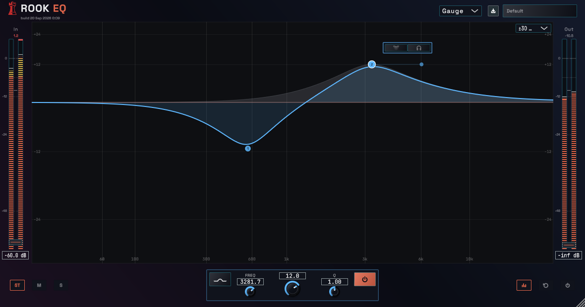

# Rook EQ

**A 12-band dynamic equalizer by Red Rook Audio.**

Shape a track, control a problem frequency, or work on the center and sides of a mix. Rook EQ brings direct curve editing, dynamic bands, and band listening into one interface.

*Development preview with example EQ settings and meter levels.*

## Features

- **12 EQ bands** with bell, shelf, tilt, notch, band-pass, low-cut, and high-cut filters.
- **Dynamic EQ** with threshold, attack, release, and external sidechain control on gain-based filters.
- **Stereo, Mid, and Side processing** for full-mix and targeted stereo work.
- **Band listening** to isolate a frequency region and sweep it by ear.
- **Output spectrum analyzer** with adjustable resolution, smoothing, and peak hold.
- **Presets, input/output trims, and five interface themes.**

## Availability

Rook EQ is in development. The current release target is **Windows, 64-bit VST3**.

There is no public download or announced release date. This repository is the public home for product information, documentation, and feedback. The plugin's source code is private.

## Documentation and feedback

- [Quick start and controls](docs/user-guide.md)
- [Interface screenshots](docs/screenshots.md)
- [Support and bug reports](SUPPORT.md)
- [Report a bug](https://github.com/cwagoner78/rook-eq-public/issues/new?template=bug_report.yml)
- [Suggest a feature](https://github.com/cwagoner78/rook-eq-public/issues/new?template=feature_request.yml)

Copyright 2026 Red Rook Audio. All rights reserved.
