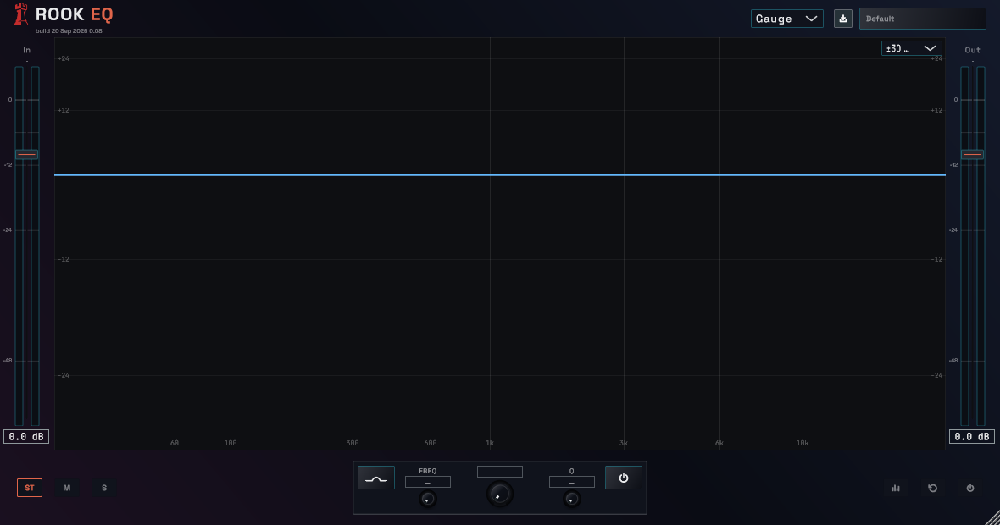

# Interface screenshots

Development previews of Rook EQ in the Gauge theme. These captures show the plugin interface with example settings; the meter levels are illustrative.

## Working with bands

Two bands on the response curve, with controls for the selected band below the graph.

## Starting a session

The default view opens with no active bands. Input and output trims, Stereo/Mid/Side views, and analyzer controls remain within reach.

[Read the quick start](user-guide.md)
